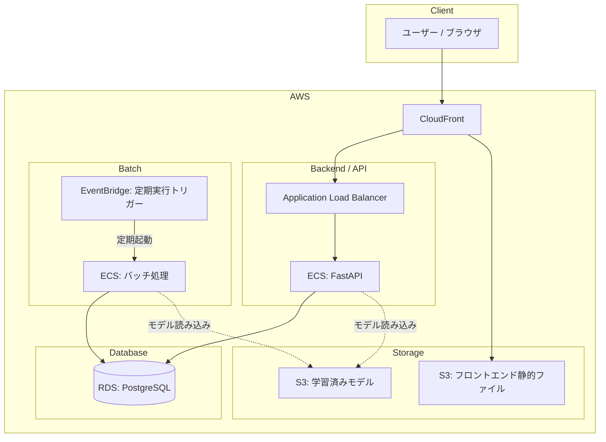

# Customer Churn Prediction Dashboard
### 機械学習による顧客退会確率予測・シミュレーションアプリ

<!-- アプリの操作動画 -->
<!--  -->

---

## 1. 課題定義と目的

### 背景
サブスクリプション型サービスにおいて、顧客の退会（Churn）防止は重要なテーマの一つとされています。  
退会の兆候を早期に捉えて適切なフォローを行うことの重要性を感じ、本アプリを作成しました。

### アプリの概要
Kaggleコンペを参考に独自生成した疑似顧客データと機械学習モデルを活用し、各顧客の「退会確率」を可視化・シミュレーションできるダッシュボードを作成しました。

* **顧客一覧（左パネル）**:  
    事前計算（夜間バッチ）した退会確率を含めた顧客情報を一覧で表示
* **退会確率シミュレータ（右パネル）**:  
    スライダー操作（予測API）により、利用状況の変化（通話時間）による退会リスクの変動をリアルタイムで確認

単に予測結果を見るだけでなく、現場の担当者が「どのようなアプローチが効果的か」を直感的に試行錯誤できるツールを目指しました。

#### ⚙️ バッチ / API 両パターンの推論を実装した背景
実務における機械学習の運用では、推論の目的に応じて主に2つのパターンがあると知り、  
本アプリでは、1つのシステム内に両方の推論ロジックを組み込む設計に挑戦しています。

* **バッチ推論（大量データの一括処理）**:  
  夜間処理等で事前計算してDBに保存しておくことで、ダッシュボード初期表示時のレスポンス速度を確保
* **API推論（ユーザー操作への即座な応答）**:  
  UIのスライダー操作と連携し、パラメータ変更に応じたリアルタイムな再計算と画面描画を実現

---

## 2. 機械学習モデルの検証と選定プロセス

> 以下のステップで検証・選定を行いました。  
詳細は `notebooks/` フォルダ内のJupyter Notebookにまとめています。

### ① ベースラインの設定とモデル比較
不均衡データにおける予測精度を適切に評価するため、段階的なモデル検証を行いました。
* **DummyClassifier（ベースライン）**:
  最小限の基準（ベースライン）として設定。
* **DecisionTreeClassifier（決定木）**:
  単一木モデルを作成し、特徴量の重要度やデータの傾向を確認。
* **RandomForestClassifier（ランダムフォレスト）**:
  過学習を抑えつつ予測精度を向上させるため、アンサンブル学習であるランダムフォレストを採用。

### ② 評価指標の選定
本データセットは「退会しない顧客」が大半を占める**不均衡データ**です。  
このようなデータでは、すべて「退会しない」と予測するだけでも高い **正解率（Accuracy）** が出てしまい、モデルの真の識別性能を評価できません。  
そのため、正解率だけでなく、モデルの識別能力を適正に評価できる **AUC（ROC-AUC）** を主要な評価指標として採用しました。

### ③ 実験管理
各モデルのハイパーパラメータや評価メトリクス（Accuracy, AUC等）はローカルの **MLflow** で管理し、再現性と比較の容易性を担保しています。

### ④ パイプライン化と推論構成
- **前処理とモデルの一元管理**:  
    前処理と学習済みモデルを `Pipeline` として一括保存することで、推論時の前処理漏れやデータリークを防止しています。
- **バッチ / API の両立**:  
    保存したPipelineオブジェクトを活用し、夜間バッチ処理とFastAPI経由のリアルタイム推論の両方に対応させています。

---

## 3. システム構成

<!-- アーキテクチャ図 -->


### 🛠 技術スタック

| カテゴリ | 技術要素 |
| :--- | :--- |
| **Frontend** | TypeScript, React(Vite), Chakra UI |
| **Backend / ML** | Python, FastAPI, Pandas, scikit-learn, MLflow, pytest, Jupyter Notebook |
| **Database** | PostgreSQL, SQLite |
| **Infrastructure / DevOps** | Docker, Docker Compose, Linux, Git, GitHub Actions (CI/CD) |
| **AWS** | CloudFront, S3, ALB, ECS, ECR, RDS, Route 53, ACM, Parameter Store, IAM, EventBridge |

---

## 4. 開発・設計のポイント

* **サーバーレスな夜間バッチによるコスト最適化**:  
  バッチサーバーを常時稼働させず、**EventBridge** から **ECSタスク** を定期起動する設計を採用。  
  処理完了後にコンテナが自動終了するため、無駄なインフラコストを最小限に抑えています。

* **学習済みモデルの分離と軽量なコンテナ運用**:  
  Dockerイメージ内に重いモデルファイルを埋め込まず、**S3** に保管してコンテナ起動時にロードする構成に分離。  
  イメージサイズを軽量に保ち、モデル更新時のデプロイを容易にしています。

* **Pipeline化による前処理・推論の一貫性担保**:  
  `Pipeline` を用いて前処理とモデルを一括保存。  
  学習時と推論時のデータ前処理のズレ（データリークや前処理の重複開発）を防ぎ、バッチ処理とWeb APIの両方で安全に再利用しています。

* **CI/CD環境とコード品質の自動化**:  
  **GitHub Actions** を構築し、コード変更時の自動テストやリンターチェック、S3/ECR/ECSへのデプロイを自動化。  
  開発効率と品質の維持を両立しています。

---

## 5. ローカル開発環境の起動方法

ローカル環境では Docker Compose を使用して、バックエンド・フロントエンド・データベースの動作確認が可能です。

```bash
# 1. リポジトリのクローンと移動
git clone https://github.com/ito-biz-work/churn-prediction-app.git
cd churn-prediction-app

# 2. 環境変数の準備（テンプレートをコピー）
cp frontend/.env.example frontend/.env

# 3. コンテナの起動
docker compose -f compose.dev.yaml up -d --build
```